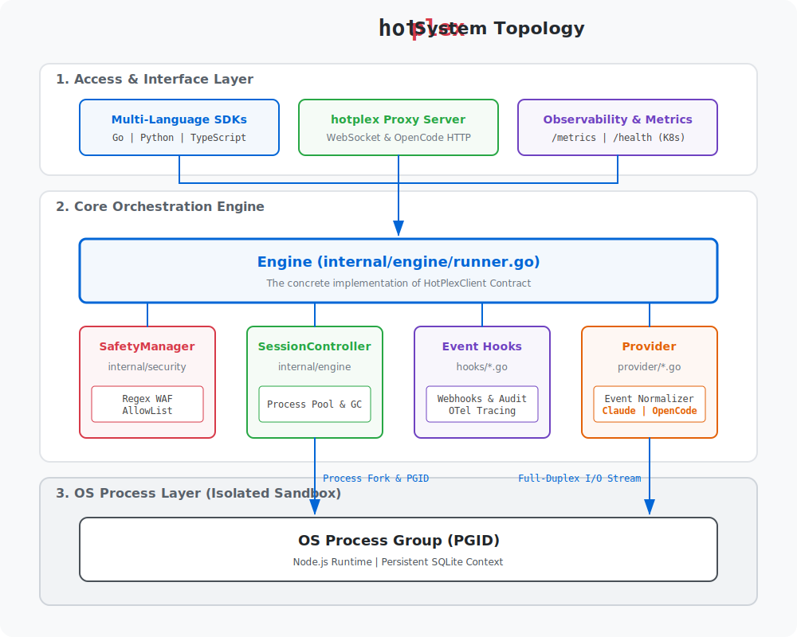

# 🔥 hotplex

<p align="center">
  <a href="https://github.com/hrygo/hotplex/actions/workflows/ci.yml"></a>
  <a href="https://github.com/hrygo/hotplex/releases"></a>
  <a href="https://pkg.go.dev/github.com/hrygo/hotplex"></a>
  <a href="https://goreportcard.com/report/github.com/hrygo/hotplex"></a>
  <a href="LICENSE"></a>
</p>

> **From 5000ms 🐢 to 200ms 🚀. hotplex keeps your AI agents hot.**

*Read this in other languages: [English](README.md), [简体中文](README_zh.md).*

**hotplex** is a high-performance **Process Multiplexer** designed specifically for running heavy, local AI CLI Agents (like Claude Code, OpenCode, Aider) in long-lived server or web environments. 

It solves the "Cold Start" problem by keeping the underlying heavy Node.js or Python CLI processes alive and routing concurrent request streams (Hot-Multiplexing) into their Stdin/Stdout pipes.

## 🚀 Why hotplex?

Running local CLI agents from a backend service (like a Go API) usually means spawning a new OS process for *every single interaction*. 

*   **The Problem:** Tools like `claude` (Claude Code) are heavy Node.js applications. Firing up `npx @anthropic-ai/claude-code` takes **3-5 seconds** just to boot up the V8 engine, read the filesystem context, and authenticate. For a real-time web UI, this latency makes the agent feel incredibly slow and unresponsive.
*   **The Solution:** hotplex boots the CLI process *once* per user/session, keeps it alive in the background (within a secure `pgid`), and establishes a persistent pipeline. When the user sends a new message, hotplex instantly injects it via `Stdin` and streams the JSON responses back via `Stdout`. Latency drops from **5000ms to < 200ms**.

## 💡 Vision & Use Cases

hotplex empowers AI applications to integrate powerful CLI agents (like **Claude Code**, **Aider**, or **OpenCode**) as their external "muscles." Instead of reinventing the wheel, your app can leverage these mature tools with sub-second latency.

*   🌐 **Web-based AI Agents**: Build a fully functional Web UI for Claude Code. Users interact via a browser while hotplex manages persistent, sandboxed CLI processes.
*   🔧 **DevOps Automation**: Integrate AI directly into toolchains. Have agents execute shell scripts, analyze K8s logs, and troubleshoot infrastructure over a persistent session.
*   🚀 **CI/CD Intelligence**: Embed code review and dynamic bug fixing into pipelines without the heavy boot overhead of Node.js tools.
*   🕵️ **Intelligent AIOps**: Create bots that continuously monitor systems and execute safe remediation commands via controlled terminal sessions.

## ✨ Key Features

*   **⚡ Blazing Fast Hot-Starts:** Instant response times after the initial boot (~200ms).
*   **♻️ Session Pooling (GC):** Automatically tracks and cleans up idle processes to save system resources.
*   **🛡️ Native Tool Constraints:** Hard-restrict agent capabilities (e.g., disabling `Bash` or `Internet` tools) at the engine level.
*   **🔌 WebSocket Gateway:** Includes `hotplexd`, a standalone server that exposes the multiplexer natively over WebSockets.
*   **📦 Native Go SDK:** High-level Go API for embedding the engine directly into your backend.
*   **🔥 Security Firewall:** Built-in `danger.go` pre-flight interceptor blocks destructive commands (e.g., `rm -rf /`).
*   **🔒 Context Isolation:** PGID-based process isolation and UUID v5 deterministic namespaces.

### 📦 Architecture

hotplex is designed with a two-tier architecture:



1.  **Core SDK (`pkg/hotplex`)**: The engine itself. It provides the `Engine` Singleton, `SessionPool`, and `Detector` (Security Firewall). It expects JSON streams from the CLI and emits strongly-typed Go events.
2.  **Standalone Server (`cmd/hotplexd`)**: A lightweight wrapper around the SDK that exposes it over standard WebSockets.

#### 🌊 Asynchronous Event Flow

hotplex leverages Go's concurrency for true full-duplex streaming:


*Note: The current MVP is deeply optimized for **Claude Code's** full-duplex JSON protocol (`--input-format stream-json` & `--output-format stream-json`) but is designed with a future `Provider` interface abstraction in mind.*

## ⚡ Quick Start

### 1. Running the Standalone WebSocket Server

If you just want to run the server and connect to it from a frontend or Python script:

```bash
# Install Claude Code (Recommended: Native Installer)
# macOS / Linux / WSL:
curl -fsSL https://claude.ai/install.sh | bash

# OR via Homebrew:
brew install claude-code

# OR via NPM (legacy):
npm install -g @anthropic-ai/claude-code

# Build and run the daemon
cd cmd/hotplexd
go build -o hotplexd main.go
./hotplexd
```
Server runs on `ws://localhost:8080/ws/v1/agent`. Check `_examples/websocket_client/client.js` for an integration demo.

### 2. Native Go SDK Integration

Install the library:
```bash
go get github.com/hrygo/hotplex
```

Import and use:
```go
import "github.com/hrygo/hotplex/pkg/hotplex"

opts := hotplex.EngineOptions{
    Timeout: 5 * time.Minute,
    Logger:  logger,
    PermissionMode: "bypass-permissions", // Modern CLI permission handling
    AllowedTools: []string{"Bash", "Edit"}, // Restrict capabilities at the Engine level (v0.2.0+)
}

engine, _ := hotplex.NewEngine(opts)
defer engine.Close()

cfg := &hotplex.Config{
    WorkDir:          "/tmp/sandbox",
    SessionID:        "user_123_session", // Deterministic Hot-Multiplexing ID
    TaskSystemPrompt: "You are a senior developer.",
}

ctx := context.Background()

// 1. Send Prompt & handle streaming callback
err := engine.Execute(ctx, cfg, "Refactor the main.go file", func(eventType string, data any) error {
    if eventType == "answer" {
         fmt.Println("Agent is responding...")
    }
    return nil
})
```

## 🔒 Security Posture

hotplex executes LLM-generated shell code. **Security is our top priority.**

1.  **🛡️ Capability Governance:** We prioritize native tool restrictions (`AllowedTools`) to ensure the agent only has access to specific binaries.
2.  **🔥 Danger Detector (WAF):** A regex-based layer intercepts and blocks destructive patterns (e.g., `mkfs`, `dd`, `rm -rf /`) before they reach the shell.
3.  **⚰️ Process Groups (PGID):** Termination sends `SIGKILL` to the entire process group, ensuring no orphan processes are leaked.
4.  **🏗️ Filesystem Jails:** The agent is physically locked to the designated `WorkDir`.

---

## 🗺️ Roadmap
- [ ] Provider interface abstraction (Generic support for `Aider`)
- [ ] Remote Docker sandbox execution driver
- [ ] Management REST API for session introspection
- [ ] Integration with [Firebase Genkit](https://firebase.google.com/docs/genkit)

## 👋 Contributing
We welcome contributions! Please see our [CONTRIBUTING.md](CONTRIBUTING.md) for guidelines.

## 📄 License
hotplex is released under the [MIT License](LICENSE).
