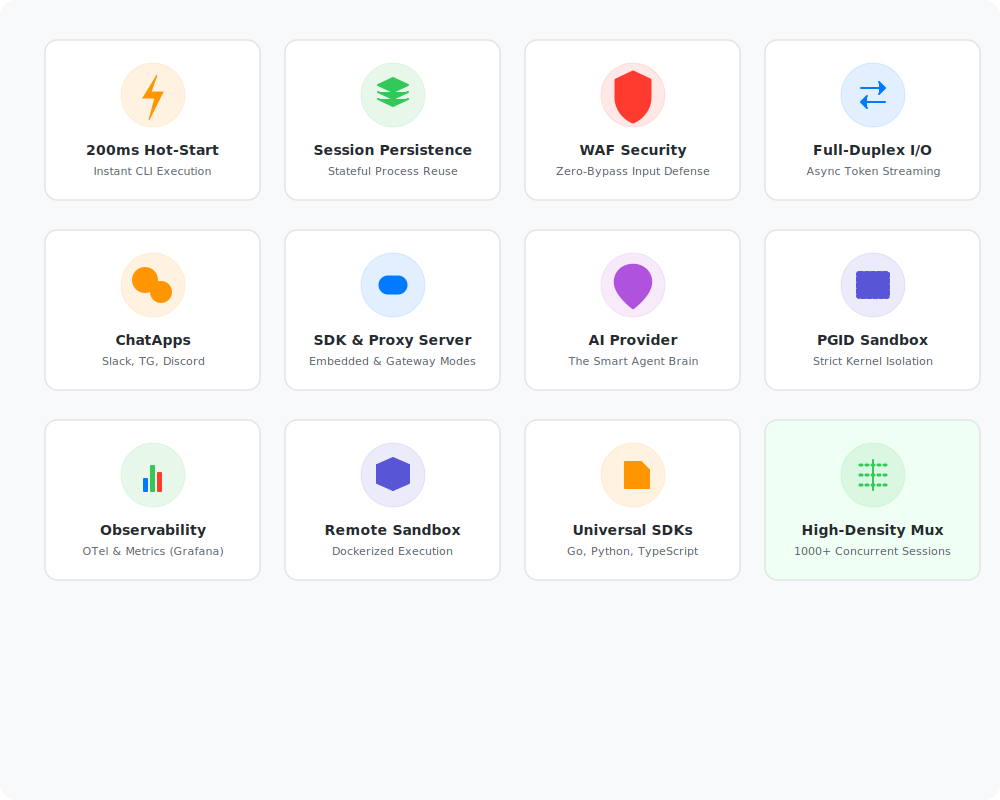

<div align="center">
  
  <h1>hotplex</h1>
  <p><b>专为 AI CLI 智能体打造的高性能进程多路复用器</b></p>
  <p><i>将启动延迟从 5000ms 🐢 降至 200ms 🚀 — 让你的 AI 智能体时刻保持 "热启动" 状态。</i></p>

  <p>
    <a href="https://github.com/hrygo/hotplex/actions/workflows/ci.yml"></a>
    <a href="https://github.com/hrygo/hotplex/releases"></a>
    <a href="https://pkg.go.dev/github.com/hrygo/hotplex"></a>
    <a href="https://goreportcard.com/report/github.com/hrygo/hotplex"></a>
    <a href="LICENSE"></a>
  </p>
  <p>
    <a href="README.md">English</a> • <b>简体中文</b>
  </p>
</div>

<br/>

## ⚡ 什么是 hotplex？

**hotplex** 旨在解决重型 AI CLI 智能体（如 Claude Code、Aider、OpenCode 等）的**“冷启动”痛点**。
它不再为每次请求都去重新拉起进程和初始化 Node.js / Python 运行时，而是统一维护一个持久化、线程安全的进程池。这种机制使得请求能够获得**毫秒级的响应延迟**，同时支持**全双工的异步事件流**，便于与各类 Web 后端以及调度器进行无缝集成。

<div align="center">
  
</div>

### 为什么选择 hotplex？
- 🚀 **200ms 极速热启动**：瞬间响应，与直接调用 API 的低延迟体验媲美。
- ♻️ **进程会话池**：自动管理的底层操作系统进程池，内置空闲垃圾回收（GC）机制。
- 🔒 **多重沙箱执行**：内置危险指令拦截（WAF）以及基于进程组 ID (PGID) 的隔离控制。
- 🔌 **全双工 I/O 操作**：原生支持 `stdin`、`stdout` 和 `stderr` 的异步实时流式传输。
- 🛠️ **双运行模式**：可以作为 **Go SDK** 原生嵌入业务代码，也可以独立作为 **WebSocket 网关** 部署服务。

---

## 🏗️ 架构设计

hotplex 实现了 **接入层（Access Layer）** 与 **引擎执行层（Engine Layer）** 的彻底解耦，它利用有限容量的 Go Channel (管道) 和 WaitGroup 机制，大规模场景下依然能够保证确定性且安全的并发 I/O 处理。

### 1. 系统拓扑图
<div align="center">
  
</div>

- **接入层 (Access Layer)**：支持原生的 Go SDK 本地调用，或者远程的 WebSocket 连接请求 (`hotplexd`)。
- **引擎层 (Engine Layer)**：以单例模式管理资源管理器、会话池分配、配置属性覆盖以及核心安全 WAF。
- **进程层 (OS Process Layer)**：实际工作的子进程，位于 PGID 级别的隔离工作区内，并被严格锁定在指定的目录边界中工作。

### 2. 全双工异步事件流
<div align="center">
  
</div>

不同于标准 RPC 或 REST 的“请求-响应”循环模式，hotplex 深度接入 Go 的非阻塞并发模型中。`stdin`、`stdout` 和 `stderr` 在客户端和服务端子进程之间进行持续的双向管道通信，确保本地 LLM 工具能够以亚秒级的速度输出令牌（Token）。

---

## 🚀 快速开始

### 方案 A：作为 Go SDK 库嵌入
将引擎作为一个零开销、内存级集成的模块，直接植入你的 Go 后端服务中。

**安装包依赖：**
```bash
go get github.com/hrygo/hotplex
```

**代码接入示例：**
```go
package main

import (
    "context"
    "fmt"
    "time"
    "github.com/hrygo/hotplex"
)

func main() {
    // 1. 初始化引擎单例
    opts := hotplex.EngineOptions{
        Timeout:         5 * time.Minute,
        PermissionMode:  "bypass-permissions",
        AllowedTools:    []string{"Bash", "Edit", "Read", "FileSearch"},
    }
    engine, _ := hotplex.NewEngine(opts)
    defer engine.Close()

    // 2. 配置会话信息以保证状态持久化路由
    cfg := &hotplex.Config{
        WorkDir:          "/tmp/ai-sandbox",
        SessionID:        "user-123", // 确保连接被正确路由到一个"热"进程
        TaskSystemPrompt: "你是一个资深的 Go 语言系统工程师。",
    }

    // 3. 挂载流式回调监听并执行
    ctx := context.Background()
    err := engine.Execute(ctx, cfg, "重构 main.go 以增强代码的错误处理逻辑。", 
        func(eventType string, data any) error {
            if eventType == "answer" {
                fmt.Printf("🤖 Agent -> %v\n", data)
            }
            return nil
        })
    if err != nil {
        fmt.Printf("执行失败: %v\n", err)
    }
}
```

### 方案 B：独立运行 WebSocket 守护进程网关
将 `hotplexd` 作为一个独立的基础设施守护进程部署，为跨语言生态（如 React, Node.js, Python, Rust 等客户端）提供底层支撑。

**编译并运行：**
```bash
make build
./bin/hotplexd --port 8080 --allowed-tools "Bash,Edit"
```

**连接与控制：**
通过你的 WebSocket 客户端连接至 `ws://localhost:8080/ws/v1/agent`。可直接查看项目根目录的 `_examples/websocket_client/` 以了解完整的 Web 客户端交互实现。

---

## 🛡️ 安全防御体系

CLI 智能体本质上是在直接执行 LLM 生成的 raw Shell 命令。**安全绝不能被当作事后的补救手段。** hotplex 采用了深度的防御策略体系：

| 保护层级                  | 实现方式                              | 防护能力                                                   |
| :------------------------ | :------------------------------------ | :--------------------------------------------------------- |
| **I. 工具能力控制**       | `AllowedTools` 安全放行名单           | 精准约束智能体内部可以操作使用的工具集范围                 |
| **II. 危险探测 WAF**      | 正则与字符串组合拦截分析              | 硬性拦截及阻断 `rm -rf /`、`mkfs`、`dd` 等破坏性宿主机指令 |
| **III. 操作系统进程隔离** | 基于进程组 ID (`PGID`) 派发 `SIGKILL` | 防止衍生的孤儿后台守护进程以及僵尸进程导致的泄漏           |
| **IV. 文件系统隔离沙箱**  | 工作目录 (`WorkDir`) 锁定限制         | 把智能体的视界及修改权限严格限制在给定的项目根目录中       |

---

## 💡 典型应用场景

| 领域                        | 具体应用                                                             | 核心收益                                                                |
| :-------------------------- | :------------------------------------------------------------------- | :---------------------------------------------------------------------- |
| 🌐 **面向 Web 的 AI 客户端** | 让用户能直接在浏览器内驱动并体验 "Claude Code" 级别的聊天窗工具。    | 完美保持了多次对话状态与会话上下文的持久留存。                          |
| 🔧 **DevOps 自动运维平台**   | 由 AI 自主驱动的 Bash 脚本生成及运行，现场分析 Kubernetes 运行日志。 | 通过远程云端控制极速执行，免去了每次都重新拉起 Node/Python 环境的耗时。 |
| 🚀 **CI/CD 深度集成智能**    | 代码提交智能审计、格式化自动修复，以及高危基础代码漏洞修复。         | 可一键无损对接到 GitHub Actions 或者 GitLab CI 流水线 Runner 节点中。   |
| 🕵️ **AIOps 日常排雷护航**    | 针对 Pods 节点进行故障排查，并在可控范围内使用 remediation 命令。    | 内置的安全正则 WAF 强效保障了 AI 绝不会酿成生产环境瘫痪。               |

---

## 🗺️ 未来线路规划

我们正积极演进 hotplex 引擎框架，使其成为未来本地 AI 工具生态中最值得信赖的核心执行引擎：

- [ ] **执行期提供者解耦化 (Provider Abstraction)**: 将目前的 Claude Code 支持延展到原生的 Aider、OpenCode 和独立构建的 Docker 运行时环境。
- [ ] **远程调度安全钩子 (Remote Execution Hooks)**: 支持远端投递 SSH / Docker 的执行负载，实现物理网络和主机级别的沙箱隔离层。
- [ ] **运行状态透视管理 API (Introspection API)**: 增加统一暴露的 REST 管理接口，监控列举会话、实时资源管理，以及进程热终止。
- [ ] **生态框架并轨 (Framework Integration)**: 提供面向 Firebase Genkit 和 LangChain 的官方集成 Plugin 支持。

---

## 🤝 参与项目建设

欢迎为本项目提交代码贡献！提出 PR 前请确保您的代码通过了所有流水线检查项。

```bash
# 验证代码格式规范（Lint）
make lint

# 运行单元测试并进行内存竞态检查（Race Check）
make test
```
关于架构规范与 PR 提交说明，详情请查阅 [CONTRIBUTING.md](CONTRIBUTING.md) 文件。

---

## 📄 许可协议

hotplex 开源采用 [MIT License](LICENSE) 许可协议发布。

<div align="center">
  <i>以 <b>❤️</b> 为 AI 工程化社区倾力构建。</i>
</div>
