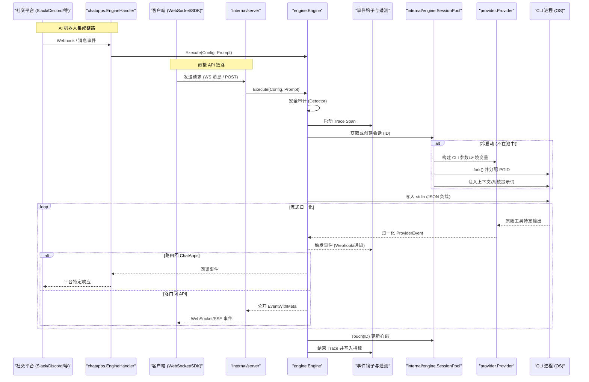

# hotplex 核心架构设计文档

*查看其他语言: [English](architecture.md), [简体中文](architecture_zh.md).*

hotplex 是一个高性能的 **AI 智能体运行时 (Agent Runtime)**，旨在将原本“单次运行”的 AI CLI 工具（如 Claude Code, OpenCode）转化为生产就绪的长生命周期交互服务。它的核心哲学是“利用胜于构建 (Leverage vs Build)”，通过维护持久化的、具备安全围栏的全双工进程池，彻底消灭 Headless 模式下的冷启动代价，实现毫秒级的指令响应。

---

## 1. 物理布局与清洁架构 (Physical Layout)

HotPlex 遵循分层架构与严格的可见性规则，将公开 SDK 与内部执行细节、协议适配器完全隔离。

### 1.1 目录结构（实测）
- **根目录 (`/`)**：SDK 的主要入口。包含 `hotplex.go` (公开别名) 以及 `client.go`。
- **`engine/`**：公开的执行运行器 (`Engine`)。编排 Prompt 执行、安全 WAF 审计及事件分发。
- **`provider/`**：不同 AI CLI 智能体的抽象层。包含 `Provider` 接口及 `claude-code`、`opencode` 的具体实现。
- **`types/`**：基础数据结构 (`Config`, `StreamMessage`, `UsageStats`)。
- **`event/`**：统一事件协议与回调定义 (`Callback`, `EventWithMeta`)。
- **`chatapps/`**：**平台接入层**。将 HotPlex 连接到社交平台（Slack, Discord, Telegram 等）。
  - `engine_handler.go`：将平台消息桥接为引擎指令。
  - `manager.go`：机器人适配器的生命周期管理。
  - `processor_*.go`：消息格式化、频率限制和线程管理的处理器链。
- **`internal/engine/`**：核心执行引擎。管理 `SessionPool` (进程复用) 与 `Session` (I/O 管道与状态管理)。
- **`internal/persistence/`**：会话持久化标记与进程池恢复逻辑。
- **`internal/security/`**：基于正则的指令级 WAF (`Detector`)。
- **`internal/config/`**：支持热加载的配置监听器。
- **`internal/sys/`**：跨平台进程组管理 (PGID) 与信号处理的底层实现。
- **`internal/server/`**：协议适配层。包含 `hotplex_ws.go` (WebSocket) 与 `opencode_http.go` (REST/SSE)。
- **`internal/strutil/`**：高性能字符串处理与路径清洗工具。

### 1.2 设计原则
1.  **公开层薄，私有层厚**：根包 `hotplex` 仅提供最小且稳定的 API 表面。
2.  **策略模式 (Provider)**：将引擎与特定 AI 工具解耦。`provider.Provider` 允许在不改变执行逻辑的情况下切换后端。
3.  **IO 驱动状态机**：`internal/engine` 使用 IO 信号标记而非固定延时来管理进程状态（启动中、就绪、忙碌、死亡）。

---

## 2. 核心系统组件

### 2.1 引擎运行器 (`engine/runner.go`)
*   **Engine 单例**：用户的主要接口 (`NewEngine`, `Execute`)。
*   **安全注入**：动态将全局 `EngineOptions`（如 `AllowedTools`）注入下游会话。
*   **确定性会话 ID**：使用 UUID v5 将业务对话 ID 映射为持久会话，确保高上下文缓存命中率。

### 2.2 适配层 (`provider/`)
将多样的 CLI 协议标准化为统一的 "HotPlex 事件流"：
*   **Provider 接口**：处理 CLI 参数构建、输入负载格式化与事件解析。
*   **工厂与注册表**：`ProviderFactory` 管理实例创建，`ProviderRegistry` 缓存活跃实例以供复用。

### 2.3 会话管理器 (`internal/engine/pool.go`)
*   **热连结 (Hot-Multiplexing)**：`SessionPool` 维护活跃进程表。对同一 SessionID 的重复请求将跳过“冷启动” (fork)，直接进行“热执行” (stdin 注入)。
*   **优雅 GC**：使用 `cleanupLoop` 根据 `IdleTimeout` 定期清理空闲进程。

### 2.4 安全与系统隔离 (`internal/security/`, `internal/sys/`)
*   **正则 WAF**：`Detector` 在指令落入底层进程前进行最后的违规扫描（如 `rm -rf /`）。
*   **PGID 强隔离**：确保智能体及其产生的任何子进程（如构建脚本）都被分配唯一的进程组 ID。终止时通过 `SIGKILL` 整个进程组，彻底杜绝孤儿进程。

### 2.5 事件钩子与可观测性 (`hooks/`, `telemetry/`)
*   **Webhooks 与审计**: 旁路异步向外部系统 (Slack, Webhooks) 广播负载事件，不阻断核心热执行链路。
*   **追踪与指标**: 推送原生 OpenTelemetry 分布式追踪，并暴露 `/metrics` 接口供 Prometheus 采集。

---

## 3. 会话生命周期与数据流

---

## 4. 功能矩阵

### 核心能力
- [x] 具备 `internal/` 隔离的清洁架构
- [x] 基于策略模式的 Provider 机制 (Claude Code, OpenCode)
- [x] 弹性的会话热复用 (Hot-Multiplexing)
- [x] 跨平台 PGID 管理 (Windows Job Objects / Unix PGID)
- [x] 基于正则的安全 WAF
- [x] **双协议网关**：原生 WebSocket 与 OpenCode 兼容的 REST/SSE API
- [x] **事件钩子 (Event Hooks)**：支持 Webhook 及多种自定义审计通知接收器
- [x] **可观测性**：原生集成 OpenTelemetry 追踪与 Prometheus 性能指标 (`/metrics`)

### 规划增强
- **L2/L3 级隔离**：集成 Linux Namespace (PID/Net) 与 WASM 沙箱
- **多智能体总线**：在单一命名空间下编排多个专业化智能体
