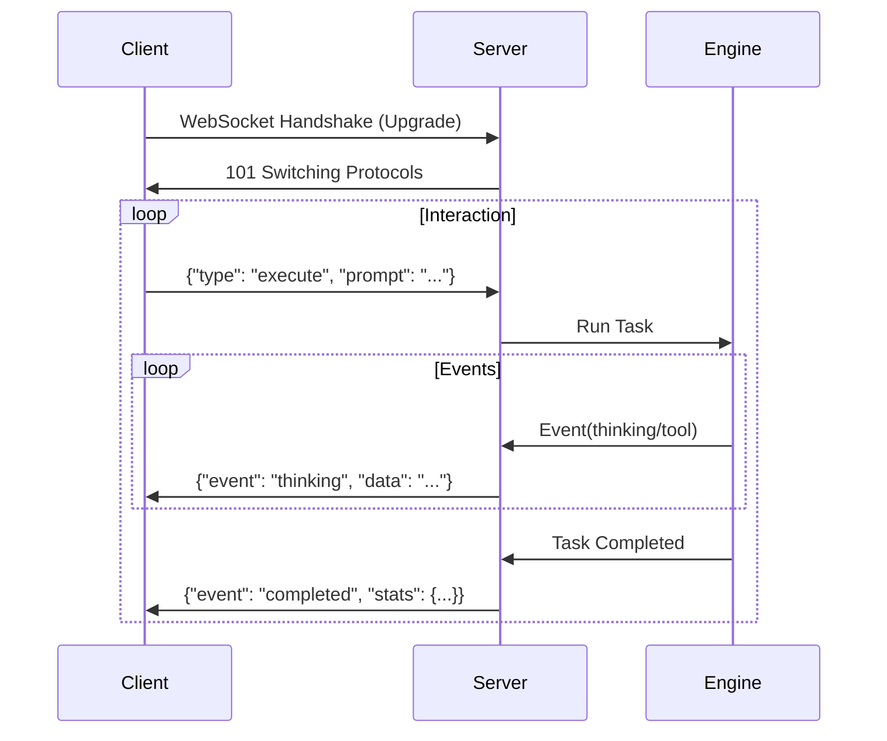

# HotPlex Server Mode Developer Manual

HotPlex supports a dual-protocol server mode that allows it to act as a production-grade control plane for AI CLI agents. It natively handles standard agent protocols and provides a compatibility layer for the OpenCode ecosystem.

## 1. HotPlex Native Protocol (WebSocket)

The native protocol provides a robust, full-duplex communication channel for real-time interaction with AI agents.

### Protocol Flow


### Authentication
If configured, the server requires an API key passed via header or query parameter:
- **Header**: `X-API-Key: <your-key>`
- **Query**: `?api_key=<your-key>`

### Client Requests (JSON)
Clients send JSON messages to control the engine.

| Field          | Type   | Description                                                |
| :------------- | :----- | :--------------------------------------------------------- |
| `type`         | string | `execute`, `stop`, `stats`, or `version`                   |
| `session_id`   | string | Unique identifier for the session (optional for `execute`) |
| `prompt`       | string | User input (required for `execute`)                        |
| `instructions` | string | System instructions/constraints                            |
| `work_dir`     | string | Sandbox working directory                                  |

### Server Events (JSON)
The server broadcasts events in real-time.

| Event         | Description                                        |
| :------------ | :------------------------------------------------- |
| `thinking`    | Model reasoning or chain-of-thought                |
| `tool_use`    | Agent initiating a tool call (e.g., shell command) |
| `tool_result` | Output/response from the executed tool             |
| `answer`      | Final text response from the agent                 |
| `completed`   | Task execution finished (includes session stats)   |
| `error`       | Protocol or execution error                        |

### Example (Python)
```python
import asyncio
import websockets
import json

async def run_agent():
    uri = "ws://localhost:8080/ws/v1/agent"
    async with websockets.connect(uri) as websocket:
        # Execute prompt
        req = {
            "type": "execute",
            "prompt": "Write a hello world script in Go",
            "work_dir": "/tmp/demo"
        }
        await websocket.send(json.dumps(req))

        # Listen for events
        async for message in websocket:
            evt = json.loads(message)
            print(f"[{evt['event']}] {evt.get('data', '')}")
            if evt['event'] == 'completed':
                break

asyncio.run(run_agent())
```

---

## 2. OpenCode Compatibility Layer (HTTP/SSE)

HotPlex provides a compatibility layer for OpenCode clients using REST and Server-Sent Events (SSE).

### Endpoints

#### Global Event Stream
`GET /global/event`
Establishes an SSE channel to receive broadcast events.

#### Create Session
`POST /session`
Returns a new session ID.
**Response**: `{"id": "uuid-..."}`

#### Send Prompt
`POST /session/{id}/message`
Submits a prompt for execution. Returns `202 Accepted` immediately; outputs flow through the SSE channel.

| Field    | Type   | Description                          |
| :------- | :----- | :----------------------------------- |
| `prompt` | string | The user query                       |
| `agent`  | string | Recommended agent name (optional)    |
| `model`  | string | Specific model identifier (optional) |

#### Server Configuration
`GET /config`
Returns server version and capability metadata.

### Security Note
Access control via `HOTPLEX_API_KEYS` environment variable is recommended for production deployments.

## 3. Error Handling & Troubleshooting

| Code                      | Reason                             | Action                          |
| :------------------------ | :--------------------------------- | :------------------------------ |
| `401 Unauthorized`        | Invalid or missing API key         | Check `HOTPLEX_API_KEY` env     |
| `404 Not Found`           | Session ID does not exist          | Create a new session first      |
| `503 Service Unavailable` | Engine overloaded or shutting down | Retry with exponential backoff  |
| `WebSocket Closure 1006`  | Connection dropped (timeout/WAF)   | Check `IDLE_TIMEOUT` or network |

### Common Issues
- **Origin Rejected**: If connecting from a browser, ensure the origin is in `HOTPLEX_ALLOWED_ORIGINS`.
- **Tool Timeout**: If a tool takes $>10\text{min}$, the connection might drop. Use `task_boundary` pulses to keep alive.

## 4. Best Practices

### Session Management
- **Persistence**: For long-running tasks, provide a consistent `session_id`. If the connection drops, you can reconnect and the engine will provide context from the existing session.
- **Cleanup**: Always send a `{"type": "stop"}` request if you wish to terminate an agent early and free up server resources.
- **Concurrency**: HotPlex supports multiple concurrent sessions per server instance. Each session is isolated in its own process group (PGID).

### Performance
- **Streaming**: Always use the event stream for real-time UI updates instead of polling.
- **Sandbox**: Keep `work_dir` consistent within a session to allow the agent to manage project state correctly.
