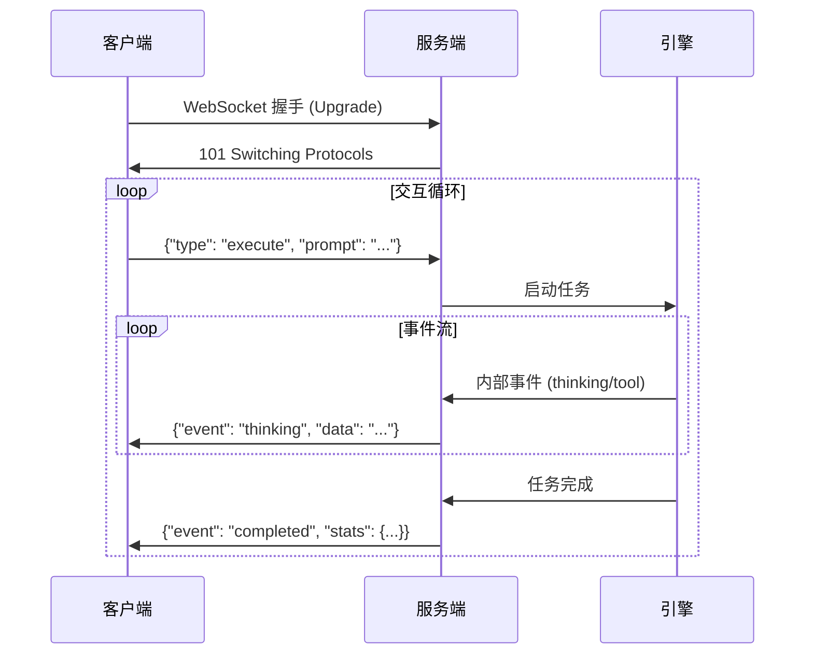

# HotPlex 服务模式开发者手册

HotPlex 支持双协议服务模式，使其能够作为 AI CLI 智能体（Agent）的生产级控制平面。它原生支持标准智能体协议，并为 OpenCode 生态提供兼容层。

## 1. HotPlex 原生协议 (WebSocket)

原生协议提供了一个健壮的全双工通信信道，用于与 AI 智能体进行实时交互。

### 协议流程


### 身份验证
如果已配置，服务器要求通过 Header 或查询参数传递 API Key：
- **Header**: `X-API-Key: <your-key>`
- **Query**: `?api_key=<your-key>`

### 客户端请求 (JSON)
客户端发送 JSON 消息来控制引擎。

| 字段           | 类型   | 描述                                     |
| :------------- | :----- | :--------------------------------------- |
| `type`         | string | `execute`, `stop`, `stats`, 或 `version` |
| `session_id`   | string | 会话的唯一标识符（`execute` 时可选）     |
| `prompt`       | string | 用户输入（`execute` 时必填）             |
| `instructions` | string | 系统指令/约束条件                        |
| `work_dir`     | string | 沙箱工作目录                             |

### 服务器事件 (JSON)
服务器实时广播事件。

| 事件          | 描述                                |
| :------------ | :---------------------------------- |
| `thinking`    | 模型推理或思维链                    |
| `tool_use`    | 智能体发起工具调用（如 Shell 命令） |
| `tool_result` | 工具执行的输出/响应                 |
| `answer`      | 智能体的最终文本响应                |
| `completed`   | 任务执行完成（包含会话统计数据）    |
| `error`       | 协议或执行错误                      |

### 示例代码 (Python)
```python
import asyncio
import websockets
import json

async def run_agent():
    uri = "ws://localhost:8080/ws/v1/agent"
    async with websockets.connect(uri) as websocket:
        # 执行 Prompt
        req = {
            "type": "execute",
            "prompt": "用 Go 写一个 Hello World 脚本",
            "work_dir": "/tmp/demo"
        }
        await websocket.send(json.dumps(req))

        # 监听事件
        async for message in websocket:
            evt = json.loads(message)
            print(f"[{evt['event']}] {evt.get('data', '')}")
            if evt['event'] == 'completed':
                break

asyncio.run(run_agent())
```

---

## 2. OpenCode 兼容层 (HTTP/SSE)

HotPlex 为使用 REST 和服务器发送事件（SSE）的 OpenCode 客户端提供兼容层。

### 端点 (Endpoints)

#### 全局事件流
`GET /global/event`
建立 SSE 信道以接收广播事件。

#### 创建会话
`POST /session`
返回一个新的会话 ID。
**响应**: `{"id": "uuid-..."}`

#### 发送提示词
`POST /session/{id}/message`
提交提示词进行执行。立即返回 `202 Accepted`；输出通过 SSE 信道流动。

| 字段     | 类型   | 描述                     |
| :------- | :----- | :----------------------- |
| `prompt` | string | 用户查询                 |
| `agent`  | string | 推荐的智能体名称（可选） |
| `model`  | string | 特定的模型标识符（可选） |

#### 服务器配置
`GET /config`
返回服务器版本和功能元数据。

### 安全注意
对于生产部署，建议通过 `HOTPLEX_API_KEYS` 环境变量启用访问控制。

## 3. 错误处理与故障排除

| 代码                      | 原因                    | 建议操作                        |
| :------------------------ | :---------------------- | :------------------------------ |
| `401 Unauthorized`        | API Key 无效或缺失      | 检查 `HOTPLEX_API_KEY` 环境变量 |
| `404 Not Found`           | 会话 ID 不存在          | 请先创建会话                    |
| `503 Service Unavailable` | 引擎负载过高或正在关闭  | 使用指数退避算法进行重试        |
| `WebSocket 1006`          | 连接异常中断 (超时/WAF) | 检查 `IDLE_TIMEOUT` 或网络配置  |

### 常见问题
- **跨域被拒绝 (Origin Rejected)**：如果是从浏览器连接，请确保 Origin 已加入 `HOTPLEX_ALLOWED_ORIGINS`。
- **工具调用超时**：如果工具执行超过 10 分钟，连接可能会断开。建议使用心跳机制保持活跃。

## 4. 最佳实践

### 会话管理
- **持久化**：对于长时间运行的任务，建议提供固定的 `session_id`。如果连接中断，重新连接并使用相同的 ID 可以恢复之前的会话上下文。
- **资源释放**：如果需要提前终止智能体并释放服务器资源，请务必发送 `{"type": "stop"}` 请求。
- **并发处理**：HotPlex 支持在单个服务器实例中运行多个并发会话。每个会话都会在独立的进程组（PGID）中隔离运行。

### 性能建议
- **流式输出**：务必使用事件流（Event Stream）进行实时 UI 更新，避免使用轮询方式。
- **沙箱环境**：在一个会话内保持 `work_dir` 的一致性，以便智能体能正确管理项目状态。
